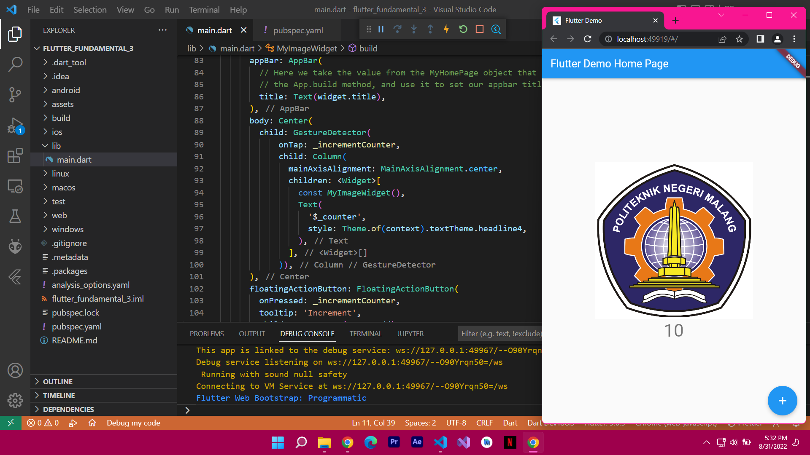
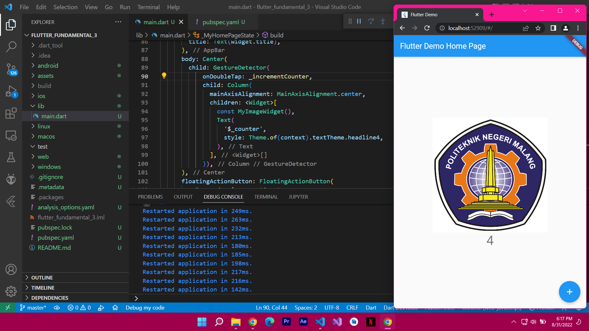
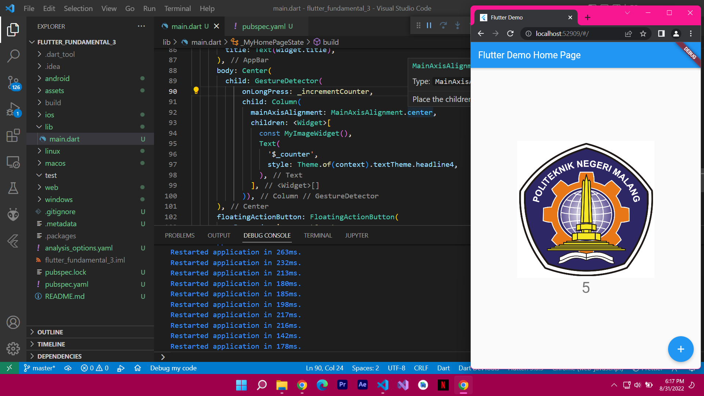
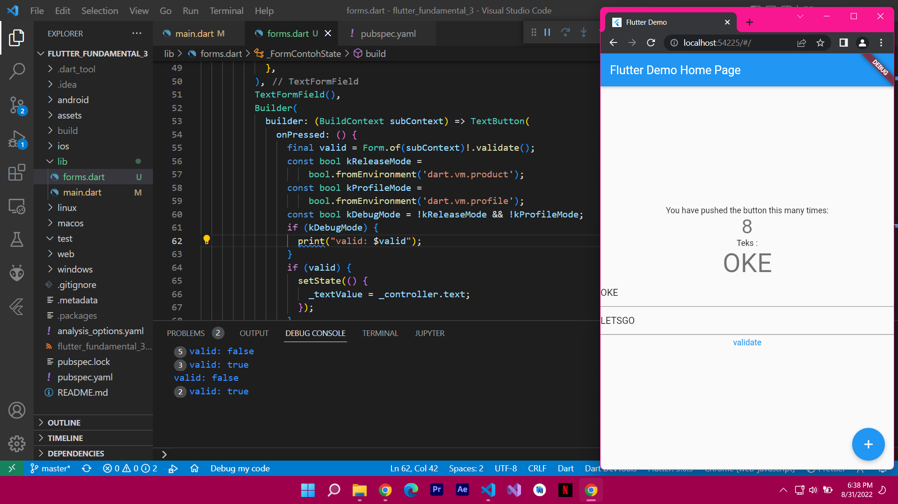
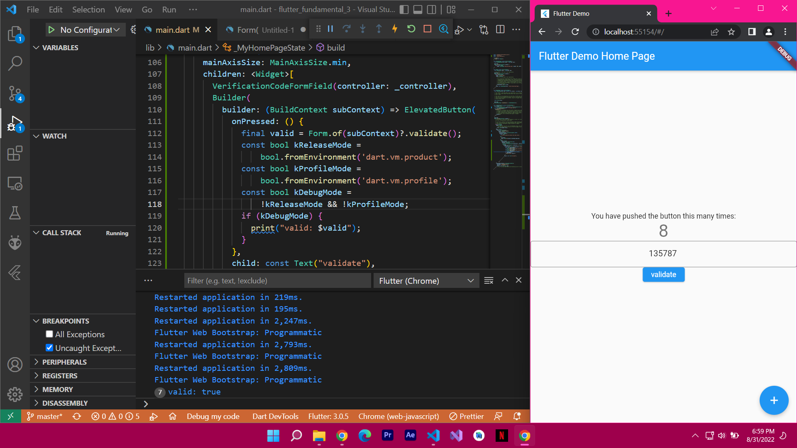
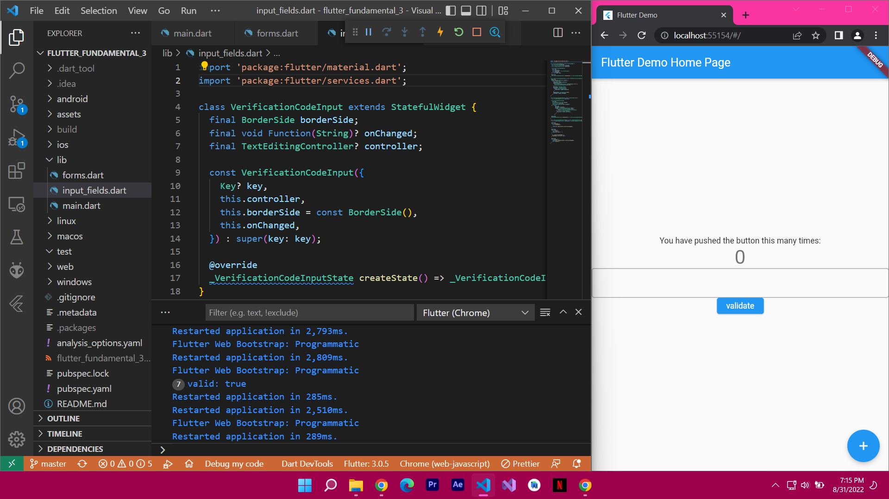

# flutter_fundamental_3

## Praktikum 1

### Penjelasan : 
### Apabila menggunakan onTap, maka dalam menjalankan methodnya,gestur akan mendeteksi jika di klik pendek atau sekali TAP, maka nilai $counter akan bertambah secara increment sesuai yang ada di method _incrementCounter, lalu jika menggunakan onDoubleTap, maka gestur akan mendeteksi jika ingin menjalankan methodnya, maka harus di tap 2 kali agar menjalankan method _incrementCounter, lalu jika menggunakan onLongPress, maka dalam menjalankan methodnya,gestur akan mendeteksi jika ditahan lama selama 1 - 2 detik, maka akan menjalankan method _incrementCounter nya. semua ini dijalankan dengan menekan fotonya. mengapa harus fotonya dan di pinggir lainnya tidak bisa ? dikarenakan dalam hal ini bagian bodynya adalah dari class MyImageWidget().
## Praktikum 2

### Penjelasan : 
### pada praktikum kali ini akan ada beberapa yang harus ditambahkan agar tidak error, yaitu dengan menambahkan 3 variabel boolean pada method onPressed yaitu kReleaseMode,kProfileMode dan kDebugMode. lalu apabila formnya telah diisi, maka ketika divalidate maka akan bernilai true, sedangkan jika form tidak berisi, maka nilainya false.
## Praktikum 3

### Penjelasan : 
### pada praktikum kali ini akan ada beberapa yang harus ditambahkan agar tidak error, yaitu dengan menambahkan 3 variabel boolean pada method onPressed yaitu kReleaseMode,kProfileMode dan kDebugMode.lalu pada file input_fileds.dart harus ditambahkan import baru yaitu import 'package:flutter/services.dart'; setelah itu hasilnya adalah file yang diinputkan hanya bisa berupa angka, sedangkan apabila memasukkan alfabet maka tidak dikeluarkan di input formnya dan maksimal hanya 6 angka dan nantinya bernilai true.

# Referensi : 
## https://api.flutter.dev/flutter/foundation/kDebugMode-constant.html